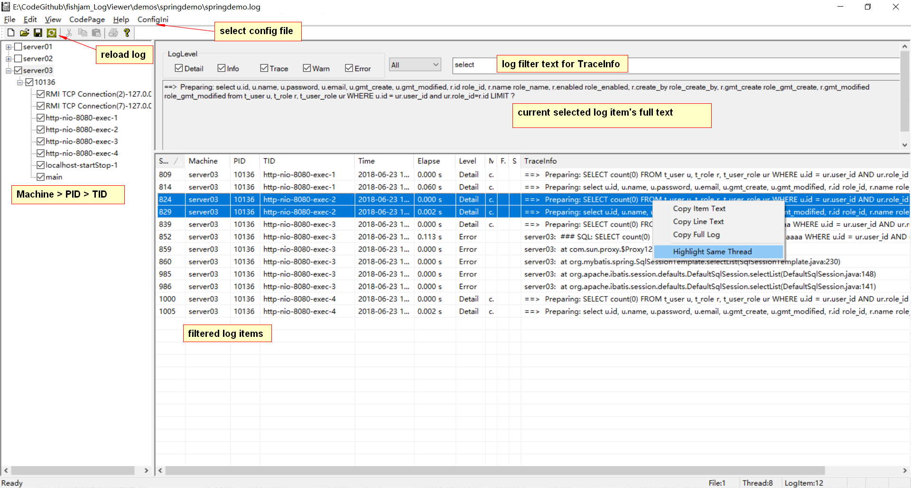

# LogViewer
  - 一个通用的日志查看器. 可以通过用户配置的正则表达式解析文本格式的日志文件(如 Spring-Boot, Android, iOS, Visual Studio 等的文本日志), 然后进行显示,搜索,过滤,分析等. ***理论上说,只要能写出日志文件的正则表达式,即可通过这个工具分析任何一种日志格式***.
 
# 功能点
  - 1.在 ini 中配置好每行日志的正则表达式(REGULAR), 即可按其解析日志, 并通过 REGMAP 部分将解析结果映射到日志的各种对应项(如 Level/PID/TID等).
  - 2.只要日志文件中有对应的内容, 即可按照 Level(日志等级), PID(进程ID), TID(线程ID) 进行分组和过滤, 支持搜索过滤等; 
  - 3.自动分析出同一线程前后两条日志的耗时, 从而方便确认性能问题;
  - 4.可以按任意列进行排序.
  - 5.如果日志中有文件名/行号(Visual Studio格式), 双击日志的话,可以通过VS打开文件并定位.
 
# 日志配置
  - 1.示例文件参见 [Standard-SpringBoot.ini](x64/Release/Dsh-SpringBoot.ini) 等,对应的示例日志文件为 [distributed spring log demo](demos/dsh-springdemo.log), 可以通过 [distributed shell](https://github.com/fishjam/dsh) 工具从多个Server上收集.
  - 2.COMMON 
    - REGULAR : 定义了一行日志的正则表达式,此为日志解析的核心部分, 推荐使用 Regex Match Tracer 等工具编写和确认正则表达式.
    - TIME_FORMAT : 定义了时间部分的格式, 目前只支持 yyyy-MM-dd HH:mm:ss.SSS 等四种格式, 配置好以后可以自动计算同一线程中前后两条日志的时间差(Elapse)
  - 3.REGMAP : 定义了正则解析出的各个分组对应日志的哪个部分, 如 ITEM_LEVEL 对应日志等级部分.
  - 4.LEVELMAP: 定义了日志等级的对应方式, 如 LEVEL_TRACE=INFO 表示日志中的 "INFO" 对应 LogViewer 中的 "Trace" 等级的日志, 可通过其进行过滤.

# TODO
 - [ ] Support pipe source, so can support real-time log(tail -f xxx | adb logcat | idevicelogsys | etc.)
  
# 程序主界面

